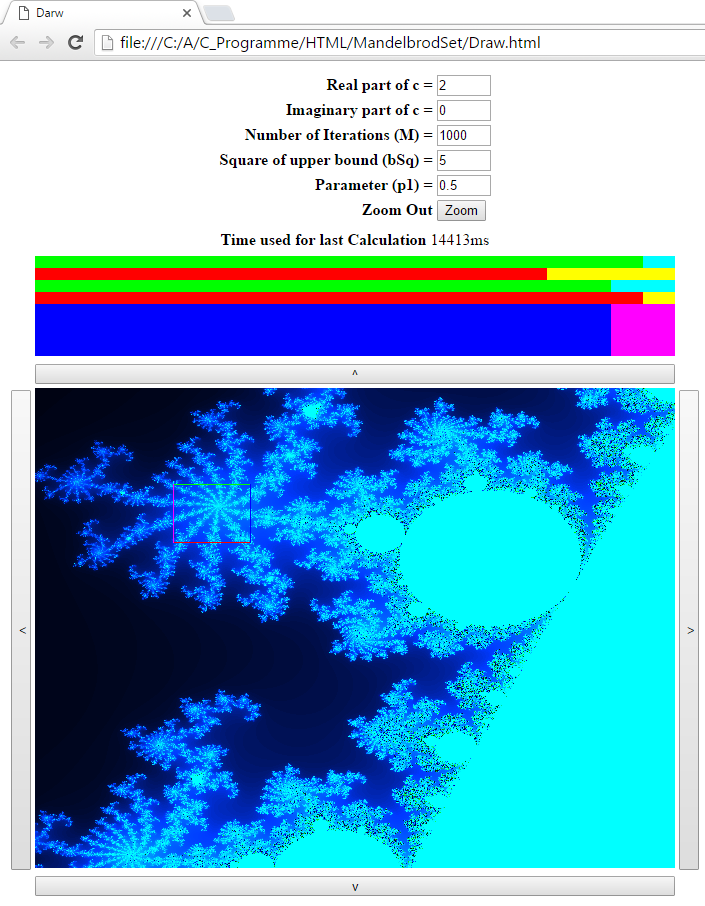

# ParallelCPUMandelbrot
Java Script project using multiythreadting to show the Mandelbrot Set on difffrent zoom levels

## Installation
Run Draw.html in google chrome. start chorme with the flag:
"C:\Program Files (x86)/Google/Chrome/Application/chrome.exe" --allow-file-access-from-files

